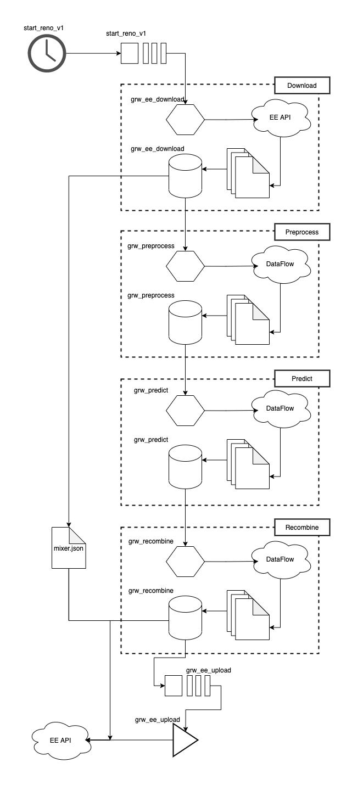

# global_renosterveld_watch

## What Is It?
This repository contains the code and instructions for building an automation pipeline for the renosterveld monitor found here [`renosterveld-monitor`](https://github.com/GMoncrieff/renosterveld-monitor). 

## How Does It Work?
The `renosterveld-monitor` works by pulling down satellite imagery from Google's [Earth Engine](https://earthengine.google.com/), transforming that data, running the data through a model that predicts areas of renosterveld that have been transformed, and then uploading a new layer to Earth Engine. 

The `global_renosterveld_watch` orchestrates this whole process through cloud services so that this workflow is automatically run on a regular period. 

### Architecture
The pipeline is shown in the diagram below. It consists of five stages all triggered by the [google cloud scheduler](https://cloud.google.com/scheduler/). 

#### `ee_download`
The download is a [cloud function](https://cloud.google.com/functions/) triggered by the `start_reno_v1` [pub sub topic](https://cloud.google.com/pubsub/). It simply builds an Earth Engine API call that downloads transformed layers of satellite data into the `grw_ee_download` [bucket](https://cloud.google.com/storage/). The layers are downloaded as GZIPed TFRecords. The size of these records are controlled by a `maxFileSize` parameter which allows us to, in turn, control the batch size of the data throughout the pipeline. In addition to the TFRecords, a `mixer.json` file is also downloaded which is used on upload (final stage of the pipeline) to allow the Earth Engine API to reconstitute the spatial relationships in the layers. 

#### `preprocess`
Each of the next three stages of the pipeline (preprocess through recombine) are composed of a cloud function and a [dataflow template](https://cloud.google.com/dataflow/docs/concepts/dataflow-templates). The cloud function is simply responsible for waiting for the last artifact from the previous stage in the pipeline to drop so it can kick off a dataflow job. It does this using a storage trigger that listens to the appropriate bucket. The dataflow job is defined by the dataflow template which are essentially just dockerized apache beam jobs. When triggering the dataflow job, the cloud functions also specify the type and number of workers allowed. 

The preprocess job itself is responsible for performing any transformations on the data required to prepare it for predictions. Amongst other things, two parts of this transformation are extremely important.

1. As we are processing this data using parallelization across workers there is no longer any guarantee that our data remains in the right order. This is a significant issue because Earth Engine is expecting the data back in the same order we downloaded it in. Therefore one critical component of the preprocess pipeline is to attach a key to each data record that will allow us to reconstitute the ordering before upload (during recombine). 
2. While the google cloud machine learning platform is not mature enough yet to support our requirements we still would like to be able to use it once it matures. Therefore the preprocess pipeline also transforms the data into a form that could be used by the machine learning cloud platform. 

#### `predict`
This stage is exactly what it says it is. Here is where we take the data points and apply the `renosterveld-monitor`'s model to produce predictions. The output is of the same format as a batch predict job from the google cloud platform.

#### `recombine`
The purpose of this stage is to reassert the ordering of our data thanks to the keys produced during the preprocessing stage and create tensorflow examples per patch of data originally given to us by Earth Engine. Once that has been accomplished the stage then writes the records back out as TFRecords for our upload call.

#### `ee_upload`
The final stage of our pipeline is run using google's [cloud run](https://cloud.google.com/run/) service. We can't use functions here because the upload call has to be done with the CLI and cloud functions don't give us finegrained access to the CLI. Cloud run allows us to dockerize our upload function and serve it as an API. In this pipeline that API listens to a pub sub on which notifications from the `grw-recombine` bucket are being published. This then allows it to know when objects have been dropped to the bucket. 

The upload then finds the appropriate TFRecords and `mixer.json` file and calls the upload Earth Engine API to create a new asset with our prediction layers.

## Using This Repo
Each of the five stages of the pipeline described above has a corresponding folder in this repository. Within each folder will be instructions on how to setup the stage as well as the code that drives each stage. 

## Advantages of this Pipeline
1. *On Demand Compute* By using cloud functions and pub sub topics to handle orchestration, we only use compute when we need it.
2. *Incredible Scalability* Thanks to the parallelization built into apache beam and Dataflow we can scale out to any size layers we want.
3. *Easy Testing* Each portion of the pipeline can be tested locally as well as in the cloud.
4. *Price Configurability* By splitting our pipeline into modules, each section can take advantage of different types of compute. Further we can exactly specify how much and what kind of compute we want to use in each stage.
5. *Future Proof* By using standard GCP services and building our predict stage to mimic GCP's machine learning platform, this pipeline should stay state of the art for years to come. 
6. *Totally Automatic* New layers will be created on a regular time interval without the need for any intervention. 
7. *Full Logging* By using standard GCP services we get all of their logging and auditing functionality as well!
